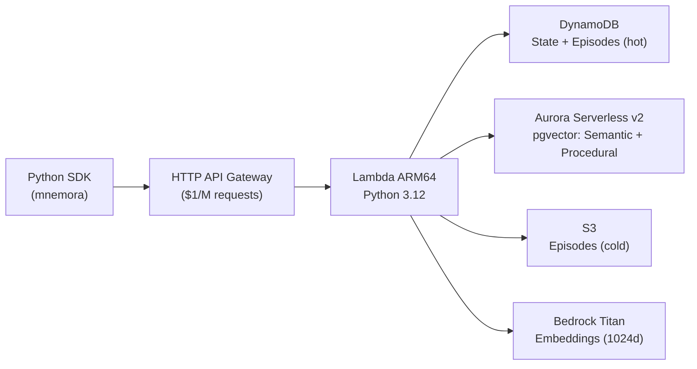

<h1 align="center">mnemora</h1>

<p align="center"><strong>Serverless memory for AI agents. One API, four memory types, zero servers.</strong></p>

<p align="center">
  
  
  
  
  
</p>

---

## The Problem

AI agents are stateless by default. To give them memory, developers stitch together Redis for state, Pinecone for vectors, Postgres for relational data, and S3 for logs. That is four databases, four clients, four billing accounts, and no unified query layer.

## The Solution

Mnemora puts all four memory types behind a single REST API:

- **Working memory** — Sub-10ms key-value state in DynamoDB, with optimistic locking and TTL.
- **Semantic memory** — Vector similarity search in Aurora pgvector, auto-embedded via Bedrock Titan (1024 dims).
- **Episodic memory** — Time-series event logs in DynamoDB (hot) and S3 (cold), with session replay.
- **Procedural memory** — Tool definitions, schemas, and rules in Postgres.

Serverless, multi-tenant by design, AWS-native. No LLM call required for CRUD operations.

---

## Architecture



---

## Quickstart

Install the SDK:

```bash
pip install mnemora
```

Your first agent memory in under 15 lines:

```python
from mnemora import MnemoraSync

with MnemoraSync(api_key="mnm_...") as client:
    # Store working-memory state
    client.store_state("agent-1", {"task": "summarize Q4 results", "step": 1})

    # Store a semantic memory — auto-embedded server-side
    client.store_memory("agent-1", "The user prefers bullet points over prose.")

    # Vector search across all stored memories
    results = client.search_memory("user formatting preferences", agent_id="agent-1")
    for r in results:
        print(r.content, r.similarity_score)

    # Log an episode to the time-series history
    client.store_episode(
        agent_id="agent-1",
        session_id="sess-001",
        type="action",
        content={"tool": "summarize", "input": "Q4 report"},
    )
```

Get your API key at [mnemora.dev](https://mnemora.dev) or [self-host in one command](#self-hosting).

---

## Memory Types

### Working Memory

Key-value state stored in DynamoDB. Sub-10ms reads. Built-in optimistic locking prevents lost updates in concurrent agents.

```python
state = client.store_state("agent-1", {"plan": ["step-1", "step-2"]}, ttl_hours=24)
current = client.get_state("agent-1")
```

### Semantic Memory

Natural-language text stored as 1024-dimensional vectors in Aurora pgvector. Content is embedded automatically on the server using Bedrock Titan. Duplicate content (cosine similarity > 0.95) is merged, not re-inserted.

```python
client.store_memory("agent-1", "User's timezone is UTC+9.", namespace="profile")
results = client.search_memory("what timezone is the user in?", agent_id="agent-1", top_k=5)
```

### Episodic Memory

Append-only time-series log of agent events. Hot data lives in DynamoDB; older data tiers to S3 automatically. Supports session replay and time-range queries.

```python
client.store_episode("agent-1", "sess-42", type="tool_call", content={"tool": "web_search", "query": "latest GDP data"})
history = client.get_session_episodes("agent-1", "sess-42")
```

### Procedural Memory

Tool definitions, prompt templates, schemas, and rules stored in Postgres. Query by name and version.

> **Coming soon.** The schema is live in Aurora. SDK methods ship in v0.2.

---

## Comparison

| Feature | Mnemora | Mem0 | Zep | Letta |
|---|---|---|---|---|
| Memory types | 4 (state, semantic, episodic, procedural) | 1 (semantic only) | 2 (semantic + temporal) | 2 (core + archival) |
| Vector search | ✅ pgvector (1024d) | ✅ External DB | ✅ Built-in | ✅ Built-in |
| LLM required for CRUD | ❌ No | ✅ Every operation | ❌ No | ✅ Every operation |
| Serverless | ✅ Fully | ❌ Cloud only | ❌ Cloud only | ❌ Server required |
| Self-hostable | ✅ CDK deploy | ❌ | Partial (Graphiti OSS) | ✅ |
| Multi-tenant | ✅ Built-in | ❌ | ✅ | ❌ |
| LangGraph checkpoints | ✅ Native | ❌ | ❌ | ❌ |
| State latency | <10ms | ~500ms (LLM) | <200ms | ~1s (LLM) |
| Framework integrations | LangGraph, LangChain, CrewAI | LangChain | LangChain | LangChain |

---

## Framework Integrations

### LangGraph

Persist graph state across invocations. Each `thread_id` maps to a Mnemora agent; checkpoint namespaces map to sessions. Optimistic locking prevents concurrent-write data loss.

```python
from mnemora import MnemoraClient
from mnemora.integrations.langgraph import MnemoraCheckpointSaver
from langgraph.graph import StateGraph

# MnemoraCheckpointSaver is async-first — pass the async client
mnemora_client = MnemoraClient(api_key="mnm_...")
saver = MnemoraCheckpointSaver(client=mnemora_client, namespace="langgraph")

graph = StateGraph(...)
app = graph.compile(checkpointer=saver)

result = await app.ainvoke(
    {"messages": [{"role": "user", "content": "Hello"}]},
    config={"configurable": {"thread_id": "thread-abc"}},
)
```

Install the extra: `pip install "mnemora[langgraph]"`

### LangChain

`MnemoraMemory` extends `BaseChatMessageHistory`. Each message is stored as a `"conversation"` episode, making the full history queryable by time range and session.

```python
from mnemora import MnemoraSync
from mnemora.integrations.langchain import MnemoraMemory
from langchain_core.runnables.history import RunnableWithMessageHistory

client = MnemoraSync(api_key="mnm_...")

chain_with_history = RunnableWithMessageHistory(
    chain,  # your existing LCEL chain
    lambda session_id: MnemoraMemory(
        client=client,
        agent_id="my-agent",
        session_id=session_id,
    ),
)
```

Install the extra: `pip install "mnemora[langchain]"`

### CrewAI

`MnemoraCrewStorage` implements the CrewAI `Storage` interface, backed by Mnemora working memory. Each storage key is a DynamoDB session; values survive process restarts and are accessible via the full Mnemora API.

```python
from mnemora import MnemoraSync
from mnemora.integrations.crewai import MnemoraCrewStorage

client = MnemoraSync(api_key="mnm_...")
storage = MnemoraCrewStorage(client=client, agent_id="crewai-researcher")

# Use storage directly, or pass to a CrewAI Agent as its memory backend
storage.save("research_plan", {"steps": ["gather", "analyze", "write"]})
plan = storage.load("research_plan")

# Full interface: save, load, delete, list_keys, reset, search
```

Install the extra: `pip install "mnemora[crewai]"`

---

## API Overview

All endpoints require `Authorization: Bearer <api_key>`. All responses follow `{ "data": ..., "meta": { "request_id": "...", "latency_ms": N } }`.

**Working Memory**

| Method | Endpoint | Description |
|---|---|---|
| `POST` | `/v1/state` | Store agent state |
| `GET` | `/v1/state/{agent_id}` | Get current state |
| `GET` | `/v1/state/{agent_id}/sessions` | List sessions |
| `PUT` | `/v1/state/{agent_id}` | Update with optimistic lock |
| `DELETE` | `/v1/state/{agent_id}/{session_id}` | Delete a session |

**Semantic Memory**

| Method | Endpoint | Description |
|---|---|---|
| `POST` | `/v1/memory/semantic` | Store text (auto-embeds) |
| `POST` | `/v1/memory/semantic/search` | Vector similarity search |
| `GET` | `/v1/memory/semantic/{id}` | Get by ID |
| `DELETE` | `/v1/memory/semantic/{id}` | Soft delete |

**Episodic Memory**

| Method | Endpoint | Description |
|---|---|---|
| `POST` | `/v1/memory/episodic` | Append an episode |
| `GET` | `/v1/memory/episodic/{agent_id}` | Query (time range + filters) |
| `GET` | `/v1/memory/episodic/{agent_id}/sessions/{session_id}` | Session replay |
| `POST` | `/v1/memory/episodic/{agent_id}/summarize` | Summarize to semantic memory |

**Unified**

| Method | Endpoint | Description |
|---|---|---|
| `POST` | `/v1/memory` | Auto-route by payload shape |
| `GET` | `/v1/memory/{agent_id}` | All memory types for an agent |
| `POST` | `/v1/memory/search` | Cross-memory search |
| `DELETE` | `/v1/memory/{agent_id}` | GDPR purge (irreversible) |

**System**

| Method | Endpoint | Description |
|---|---|---|
| `GET` | `/v1/health` | Health check |
| `GET` | `/v1/usage` | Current billing period metrics |

[Full API Reference →](docs/site/api-reference.md)

---

## Self-Hosting

Deploy the entire stack to your AWS account with CDK. Requires Node.js 18+ and AWS credentials configured.

```bash
git clone https://github.com/mnemora-db/mnemora.git
cd mnemora/infra
npm install
npx cdk deploy
```

This provisions: DynamoDB (on-demand), Aurora Serverless v2 with pgvector, Lambda on ARM64/Graviton, HTTP API Gateway, S3, CloudWatch dashboards, and a Lambda authorizer. Estimated idle cost is ~$15/month. Aurora scales to zero when not in use.

After deploy, the CDK outputs your API Gateway URL. Set it as `MNEMORA_API_URL` to point the SDK at your own deployment.

---

## Contributing

PRs are welcome. Before submitting:

```bash
# Python linting and formatting
cd api && ruff check . && ruff format .
cd sdk && ruff check . && ruff format .

# Tests
cd api && python -m pytest tests/ -v
cd sdk && python -m pytest tests/ -v

# TypeScript type check
cd infra && npx tsc --noEmit
```

See [CONTRIBUTING.md](CONTRIBUTING.md) for branching conventions and the PR checklist.

---

## License

| Directory | License |
|---|---|
| `sdk/` | [MIT License](sdk/LICENSE) |
| `infra/`, `api/` | [Business Source License 1.1](LICENSE) |
| `dashboard/` | [MIT License](dashboard/LICENSE) |
